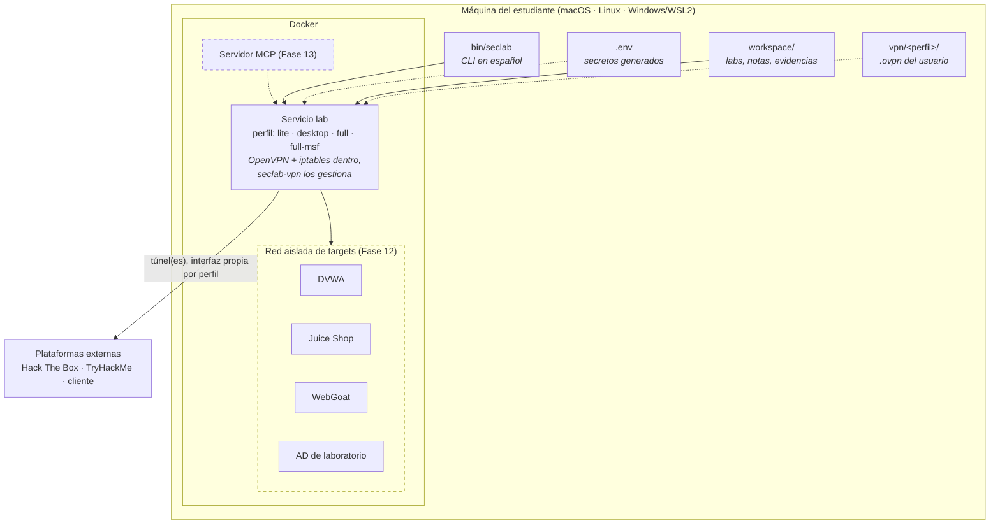
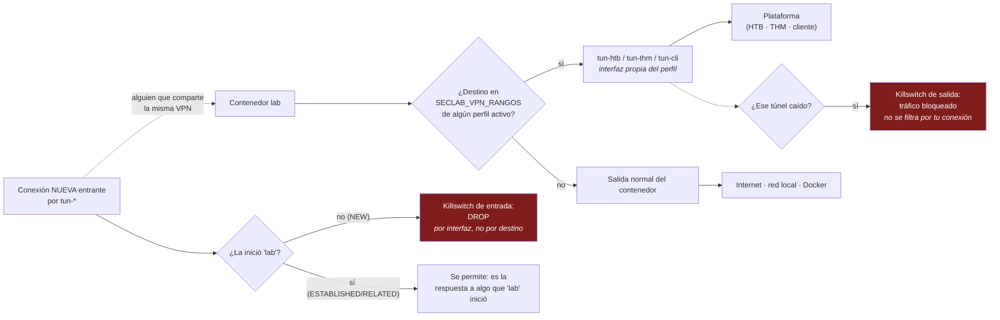
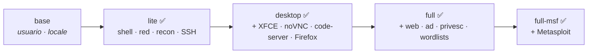

# Arquitectura

> Estado: la VPN autorizada multiperfil (Fase 7) ya está implementada. Los
> componentes que siguen marcados con *(Fase N)* —targets vulnerables y
> servidor MCP— todavía no. Este documento describe el diseño completo para
> que las piezas encajen desde el principio.

## Visión general

Lo que conviene retener del diagrama: **el contenedor de laboratorio sólo
tiene capacidades de red elevadas (`NET_ADMIN`, `/dev/net/tun`) cuando
`SECLAB_HABILITAR_VPN=true` en `.env`** (por defecto está en `false`, y
`docker-compose.vpn.yml` no se aplica). `seclab vpn up` activa la variable
solo la primera vez que hace falta, con confirmación explícita, porque exige
recrear `lab` para concedérselas — se pierde cualquier shell abierta en ese
momento, no el directorio personal ni el workspace. Y aun con la variable en
`true`, esas capacidades no hacen nada por sí solas: sólo actúan cuando
alguien ejecuta `seclab vpn up` (desde el host) o `sudo seclab-vpn up` (desde
dentro). No hay un segundo contenedor ni un cambio de espacio de red — `lab`
es siempre el mismo servicio, con la misma red y los mismos puertos, arriba o
abajo esté cualquier túnel.

**Por qué no un contenedor de VPN aparte** (el diseño que tuvo esta fase
antes de esta revisión): aislar la VPN en su propio contenedor no protegía de
nada que una interfaz TUN compartida dentro de `lab` no resolviera igual —
quien más comparte la misma VPN de plataforma (HTB, THM, un cliente) puede
alcanzar por esa interfaz a cualquiera que la use, sin que importe en qué
contenedor viva. La mitigación real es una regla de firewall sobre la propia
interfaz del túnel (ver el killswitch de entrada, más abajo), no una
topología de contenedores distinta. Con el diseño actual, además, los tres
perfiles pueden estar arriba a la vez de verdad — la arquitectura anterior
sólo podía unir `lab` al espacio de red de uno de ellos.

## Enrutamiento de los perfiles VPN

El problema que resuelve este diseño: una VPN que se lleva todo el tráfico
rompe Docker, rompe Tailscale y deja al estudiante sin red del campus. La
respuesta es no aceptar nunca la ruta por defecto que empuja el túnel.

OpenVPN arranca con `--route-nopull` y SecLab añade a mano sólo las rutas de
`SECLAB_VPN_RANGOS`. Consecuencias:

- Tu tráfico normal no pasa por la plataforma.
- Docker y Tailscale conservan sus rutas.
- Los tres perfiles pueden convivir arriba a la vez si sus rangos no se
  solapan entre sí; cada uno usa su propia interfaz (`tun-htb`, `tun-thm`,
  `tun-cli`), nunca numeradas, para poder distinguirlas sin ambigüedad en
  `ip route`, `iptables -S` o un log.
- Si un túnel cae, el tráfico hacia sus rangos se bloquea en lugar de salir
  por la interfaz normal del contenedor (killswitch de **salida**:
  `OUTPUT`/`FORWARD`).
- Además, por cada perfil activo hay una regla de killswitch de **entrada**:
  cualquier conexión NUEVA que llegue por la interfaz de ese túnel hacia un
  servicio de `lab` se descarta (`INPUT`, `DROP` en `NEW`), salvo que sea la
  respuesta a algo que `lab` inició (`ESTABLISHED`/`RELATED`, que sí se
  permite). Esto mitiga que cualquiera que comparta la misma VPN de
  plataforma pueda alcanzar `lab` por el túnel — no es un filtro de a qué IP
  te conectas tú dentro del rango, sólo de por qué interfaz entra una
  conexión.

El perfil `vpncli` puede necesitar la ruta por defecto para acceder al entorno
de un cliente. Se activa de forma explícita con `SECLAB_VPN_RUTA_DEFECTO=true`,
nunca por omisión.

## Composición de imágenes

Base: **Ubuntu 26.04 LTS** anclada por el digest de su lista de manifiestos, de
modo que `amd64` y `arm64` resuelven dentro del mismo conjunto verificado. No se
usa Kali; ver [politica-herramientas.md](politica-herramientas.md). Las etapas se
comparten para aprovechar la caché. Cada imagen lleva etiquetas con perfil,
versión, commit, fecha, arquitectura y la ruta del manifiesto de herramientas.

Los cuatro perfiles están construidos. Cada uno parte del anterior, así que la
caché se reutiliza y un cambio en la configuración del curso no obliga a
reinstalar XFCE ni a volver a descargar Metasploit.

## Archivos de Compose

| Archivo | Contenido | Fase |
|---|---|---|
| `docker-compose.yml` | Servicio de laboratorio, red, volúmenes, capacidades | 1–2 |
| `docker-compose.override.yml` | Ajustes personales de tu máquina | 1 |
| `docker-compose.vpn.yml` | Concede a `lab` NET_ADMIN y /dev/net/tun (nada más: sin servicios propios) | 7 |
| `docker-compose.targets.yml` | Targets vulnerables en red aislada | 12 |
| `docker-compose.mcp.yml` | Servidor MCP | 13 |

El nombre de proyecto es configurable (`SECLAB_PROJECT`), de modo que puedes
tener varias instancias de SecLab en la misma máquina sin que se pisen. Por eso
ningún servicio define `container_name`.

## Modo auditoría de LAN local

Por defecto, `lab` vive en el bridge de Docker (`seclab-net`) y sale a
cualquier red — la tuya local incluida — vía NAT del host, exactamente igual
que sale a Internet. Eso ya cubre la mayoría de auditorías (escaneo TCP/UDP,
enumeración de servicios), incluso con un perfil de VPN activo: el killswitch
de la Fase 7 sólo fija al túnel los rangos declarados en `SECLAB_VPN_RANGOS`
(ver "Enrutamiento de los perfiles VPN" más arriba); todo lo demás, incluida
tu LAN, sigue su ruta normal por el bridge.

Lo que el NAT no da es visibilidad de capa 2: descubrimiento por ARP, tráfico
de broadcast/multicast, "estar" en el mismo segmento físico que tus
dispositivos. Para eso hace falta que `lab` use la propia pila de red del
host en vez de una traducida.

`docker-compose.override.yml` trae, comentado, un bloque para activarlo con
`network_mode: host` (siempre bajo `!reset` en `ports`/`networks`, requisito
de Compose ≥ 2.24 cuando un servicio pasa a `network_mode`). Es estrictamente
opt-in, sólo para tu máquina, y tiene un precio real:

- El SSH del laboratorio deja de pasar por el mapeo de puertos: `sshd` escucha
  directamente en el puerto 22 de tu host, en todas sus interfaces — ya no
  sólo en `127.0.0.1`. Es una excepción consciente a "servicios ligados a
  127.0.0.1 por defecto", no algo que SecLab active por su cuenta.
- `seclab seguridad` seguirá marcándolo como fallo en cada ejecución
  (`network_mode: host` está en la lista de riesgos de
  `scripts/analizar-compose.py`). Es intencional: es el recordatorio del
  compromiso aceptado, no un error que haya que silenciar.
- Semántica completa sólo garantizada en Linux. **Comprobado en macOS con
  Docker Desktop: no sirve para ver la LAN física.** El contenedor recibe la
  red de la VM de Docker Desktop (`192.168.65.0/24` en la prueba), no la del
  Mac. Un `nmap -sn` contra esa red obtiene respuestas ARP, pero de la propia
  infraestructura de la VM (mismo MAC en varias IPs), no de dispositivos
  reales — ver `TESTING_GAPS.md`, Fase 7, para el detalle completo. Para
  auditar la LAN física desde macOS, ejecuta la herramienta de descubrimiento
  directamente en el host, no dentro del contenedor. En Linux nativo debería
  funcionar como se espera (comparte la pila de red real del host), pero no
  se ha probado ahí todavía.
- **Interacción con la VPN**: ya no hay ninguna. `docker-compose.vpn.yml`
  (ver `compose_seclab` en `lib/docker.sh`) sólo añade a `lab` `cap_add:
  NET_ADMIN` y `devices: /dev/net/tun` — no toca `network_mode`, `ports` ni
  `networks`. Este bloque y una VPN de plataforma activa conviven sin
  conflicto ni prioridad especial: puedes tener `lab` en `network_mode: host`
  y un túnel de HTB, THM o un cliente arriba al mismo tiempo. Se comprobó con
  `docker compose config` que la composición resultante es válida con ambos
  overrides aplicados a la vez.
